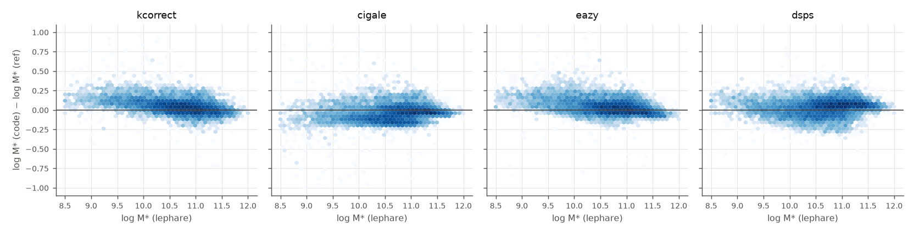
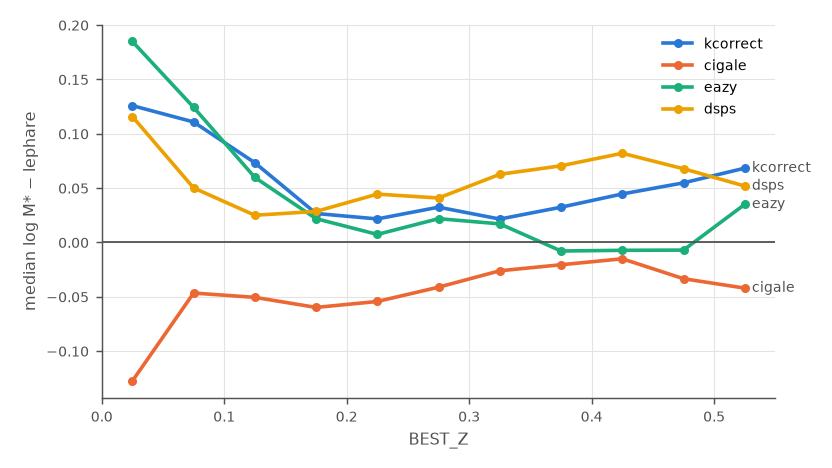
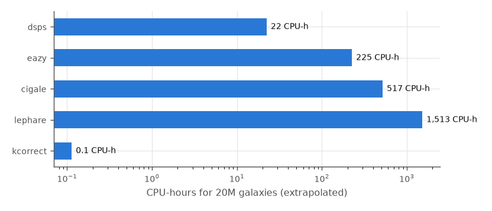

# Stellar-mass benchmark, LS DR11 BGS-like (local strip)

10000 galaxies (5000 with spectroscopic redshift), fixed z = BEST_Z, grizW1W2 with the same filter curves and error floor for every code. Reference: **lephare**.

## Cost

| code | init [s] | fit [s] | threads | ms / galaxy / thread | CPU-h for 20M |
|---|---|---|---|---|---|
| kcorrect | 2.6 | 0.2 | 1 | 0.02 | 0.1 |
| lephare | 0.3 | 118.4 | 23 | 272.43 | 1,513 |
| cigale | 0.6 | 58.1 | 16 | 93.01 | 517 |
| eazy | 0.2 | 25.3 | 16 | 40.44 | 225 |
| dsps | 3.5 | 1.7 | 24 | 4.00 | 22 |

## Agreement with the reference

Δ = log M*(code) − log M*(ref); NMAD = 1.4826 median|Δ − median Δ|.

| code | failed [%] | median χ² | median Δ | NMAD | median Δ (spec-z) | median Δ, g−r>0.8 | median Δ, g−r<0.6 | median ΔMr |
|---|---|---|---|---|---|---|---|---|
| kcorrect | 0.00 | 4.05 | +0.043 | 0.087 | +0.036 | +0.016 | +0.122 | +0.004 |
| lephare | 0.00 | 4.16 | +0.000 | 0.000 | +0.000 | +0.000 | +0.000 | +0.000 |
| cigale | 0.02 | 0.44 | -0.042 | 0.097 | -0.039 | -0.028 | -0.092 | n/a |
| eazy | 0.00 | 8.66 | +0.030 | 0.089 | +0.023 | +0.009 | +0.122 | +0.003 |
| dsps | 0.00 | 5.02 | +0.046 | 0.091 | +0.049 | +0.056 | +0.021 | -0.003 |

Median Δ in redshift bins:

| code | 0.0–0.1 | 0.1–0.2 | 0.2–0.3 | 0.3–0.4 | 0.4–0.5 | 0.5–0.6 |
|---|---|---|---|---|---|---|
| kcorrect | +0.114 | +0.048 | +0.026 | +0.027 | +0.048 | +0.070 |
| lephare | +0.000 | +0.000 | +0.000 | +0.000 | +0.000 | +0.000 |
| cigale | -0.063 | -0.055 | -0.049 | -0.024 | -0.018 | -0.042 |
| eazy | +0.137 | +0.040 | +0.012 | +0.009 | -0.007 | +0.032 |
| dsps | +0.063 | +0.027 | +0.043 | +0.066 | +0.078 | +0.058 |

## Photo-z sensitivity

Refit of photo-z galaxies at BEST_Z ± BEST_Z_ERR: half the difference of the two log M*, i.e. the mass error from the photo-z alone.

| code | N | median ½|Δ log M*| | 84th pct |
|---|---|---|---|
| kcorrect | 1000 | 0.110 | 0.216 |
| lephare | 994 | 0.094 | 0.210 |
| cigale | 1000 | 0.065 | 0.158 |
| eazy | 993 | 0.086 | 0.197 |
| dsps | 1000 | 0.077 | 0.212 |

## Comparison with the DR10 LePhare masses

4652 galaxies matched within 1″ with |Δz| < 0.005 between DR10 and DR11 BEST_Z.

| code | median log M*(DR11 code) − DR10 LPH_MASS_BEST | NMAD |
|---|---|---|
| kcorrect | +0.069 | 0.159 |
| lephare | +0.030 | 0.090 |
| cigale | +0.013 | 0.137 |
| eazy | +0.059 | 0.160 |
| dsps | +0.108 | 0.118 |

## Figures

